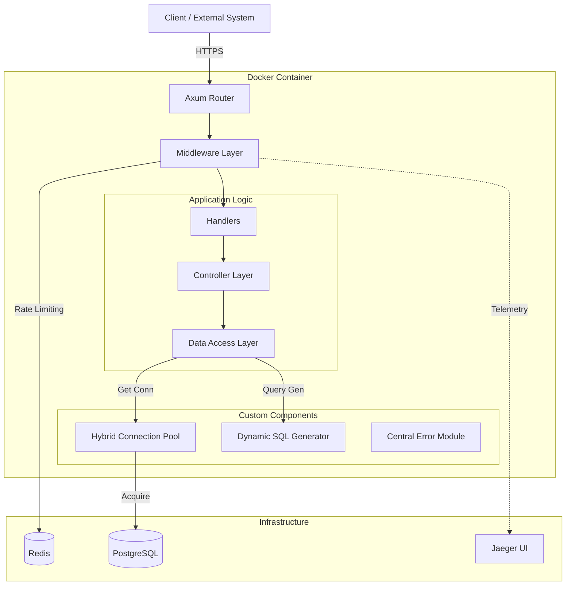

# Payment Backend System - Design Document

**Version**: 1.1  
**Last Updated**: December 21, 2025  
**Author**: Engineering Team

---

## 1. System Overview

### Purpose

The Payment Backend (Dodo Payments) is a rtcontainerized financial ledger system designed to handle multi-currency accounts and transactions. It prioritizes data integrity, precision in monetary calculations, and efficient resource utilization through custom-engineered components.

### Key Capabilities

- **Multi-Currency Support**: Unified USD storage with automatic currency conversion for global support.
- **Resource Efficiency**: Custom connection pooling with hot/cold connection strategies.
- **Observable**: Logs integration with OpenTelemetry and Jaeger tracing.
- **Rate Limiting**: Dual strategy rate limiting (IP and API Key).
- **Reliable Webhooks**: State-change driven notifications (Debit/Credit).

---

## 2. Architecture

### High-Level Architecture

The application follows a clean layered architecture, deployed as a containerized service.

### Technology Stack

- **Language**: Rust (Axum, Tokio, SQLx)
- **Database**: PostgreSQL (Account Details, Transactional data, Webhook info,Webhook history)
- **Cache**: Redis (Rate limiting, App state)
- **Observability**: OpenTelemetry + Jaeger
- **Deployment**: Docker Compose

---

## 3. Core Components Design

### 3.1 Hybrid Connection Pool `PoolStateTracker`

A custom-engineered connection pool designed for optimal resource usage and fast startup.

- **Strategy**: Eager Loading (Hot) + Lazy Loading (Cold).
- **Mechanism**:
  - **Startup**: Eagerly loads minimum required connections (e.g., 2) into memory. These remain "hot" and ready.
  - **Scaling**: If demand exceeds hot connections, new connections are lazy-loaded on demand up to the maximum limit.
  - **Race Handling**: When connections are returned:
    - If the "hot" pool is not full, the connection is cached for immediate reuse.
    - If the "hot" pool is full, the connection is dropped to free resources.
- **Benefits**: Faster boot times, memory efficiency (not holding max connections idle), and low latency for average loads.

### 3.2 Dynamic SQL Generator

Instead of a heavy ORM, a custom `sql_generator` module constructs precise SQL queries.

- **Functionality**: dynamically generates `INSERT`, `SELECT`, `UPDATE` queries based on available data fields.
- **Purpose**: Eliminates boilerplate code for CRUD operations and JOINs while maintaining type safety and performance.
- **Tradeoff**: High initial development effort vs. long-term developer velocity and query performance.

*Sql queries are precise in my testing and i made this only for CRUD and JOIN queries and didn't have much time to make support the complex queries. Primary reason for this to generate the dynamic queries based on the data availability. had took significant time of mine but its worth investing more time. it saved from writing much code and time in writing that code which is barely used. but due to time factor i couldn't able to make small changes to support webhook table. i just need to make few changes in the enums in types.rs file.*

### 3.3 Centralized Error Handling

A single source of truth for all application errors.

- **Design**: All modules map errors to a central `ServiceError` enum.
- **Benefit**: Consistent debugging experience; no "guessing" where an error originated.
- **Tracing**: Errors are automatically logged and tagged in OpenTelemetry traces.

---

## 4. Operational Considerations

### 4.1 Rate Limiting (Dual Strategy)

Implemented via Redis to protect the system from abuse and thundering herds.

*In rate limiting, we have defined two limits: the soft limit and the hard limit. The soft limit is triggered after 5 requests. Beyond this, we trigger a backoff, which uses an exponential backoff with jitter. The exponential backoff increases the waiting time for each successive request, and jitter is added to spread out the requests. This prevents the "thundering herd" problem, where multiple requests would overload the server if they were processed at the same time. The jitter ensures that the requests are distributed, reducing the chance of server overload.*

1.  **Public APIs**: Limited by **IP Address**. This is due to the fact that the public APIs are not protected by an API key.
2.  **Protected APIs**: Limited by **API Key**. This is due to the fact that the protected APIs are protected by an API key.

**Tiers**:

- **Soft Limit (5 requests)**: Triggers **Exponential Backoff + Jitter**.
  - _Purpose_: Slow down aggressive clients gently. Jitter prevents multiple clients from retrying simultaneously (thundering herd).
- **Hard Limit (20 requests)**: Triggers **Block (60s)**.
  - _Purpose_: strictly stop abusive traffic.

### 4.2 Observability
*I had planned to add histograms to OpenTelemetry, but I wasn’t able to do so due to time constraints. However, the logs are streaming properly into OpenTelemetry.*

- **Logs**: Structured JSON logs streaming to OpenTelemetry.
- **Tracing**: Full request lifecycle visualization in Jaeger UI. Allows tracing a request from API gateway -> DB query -> Webhook dispatch.

---

## 5. Data Models & Schema

### 5.1 Money Handling (Precision First)
*I decided to store all monetary values in USD. Since Dodo Payments is available in multiple regions, I selected a few popular regions from their website and added them to the code. This allows the system to convert the local currency to USD and store the converted amount in the database.*

*In the accounts table, I am also storing the prefered currency. This way, if the balance is updated manually and the request does not specify a currency, the system will use the default currency stored in the table, which is assigned during account registration (business registration).*

To avoid floating-point errors, I'm not storing the amount as a decimal. Instead, I'm storing it as an integer. I'm storing the amount as USD in the Table, but keep the prefered currency in the table for reference.

- **Storage Unit**: `i64` integers.
- **Formula**: `Storage_units = conversion::to_usd(amount , currency) * 10,000`.
- **Precision**: Supports up to 4 decimal places.
- **Currency Conversion**:
  - Input: Any supported regional currency.
  - Process: Converted to USD -> Converted to Storage_units.
  - Output: Storage_units -> USD (via `::from_row()` hook) -> Requested Currency.
  - _Note_: Accounts store a `Prefered Currency` used as default if no currency is specified in requests to convert from USD.

### 5.2 Transaction Schema (Three-Phase Flow)

The system distinguishes between recording functionality and money movement.

| Transaction Type | State Change? | Status      | Effect on Balance             | Webhook? |
| :--------------- | :------------ | :---------- | :---------------------------- | :------- |
| **Transfer**     | No            | `Pending`   | None (Record only)            | No       |
| **Debit**        | **Yes**       | `Pending`   | Subtracts from `from_account` | ✅ Yes   |
| **Credit**       | **Yes**       | `Completed` | Adds to `to_account`          | ✅ Yes   |

**Atomic Workflow**:

1.  **Begin SQL Transaction**
2.  Insert `Transfer` record (Parent).
3.  Insert `Debit` record -> Update Sender Balance -> **Dispatch Webhook**.
4.  Insert `Credit` record -> Update Receiver Balance -> **Dispatch Webhook**.
5.  **Commit SQL Transaction**
    _(If any step fails, the entire transaction rolls back)_

---

## 6. Webhook Design

### Philosophy

Webhooks are strictly for **state changes**. Consumers are notified only when money actually moves (Debit/Credit), not just when an intent (Transfer) is logged.

### Reliability

- **Trigger**: Occurs immediately after the respective balance update (inside the application flow).
- **Retries**: Built-in retry policy handles temporary failures.
- **History**: Full history stored in Postgres (`webhook_deliveries`), ensuring auditability of every notification sent.

*Couldn't allocate much time to write the production grade webhooks. This is the basic implementation of the webhook. It working as intended but it can be optimized and made production ready.*
---

## 7. Tradeoffs & Assumptions

### Design Tradeoffs

- **Custom SQL Generator vs ORM**:
  - _Decision_: Build custom.
  - _Pro_: Exact control over queries, no ORM overhead, dynamic field support.
  - _Con_: Higher initial complexity and maintenance.
- **Integer Money Storage**:
  - _Decision_: Store as `i64` scaled USD.
  - _Pro_: Zero precision loss, simplifying database math.
  - _Con_: Requires conversion logic on every read/write in accounts and transaction table.

### Assumptions

- **Scaling**: No specific TPS target yet, but architecture (async webhooks, connection pooling) is built for high throughput.
- **Deployment**: Standard Docker environment is sufficient; no Kubernetes complexity needed initially.
- **Compliance**: No specific regulatory (PCI/GDPR) constraints constraints currently active, allowing for simpler data storage designs (e.g., unified USD conversion).
